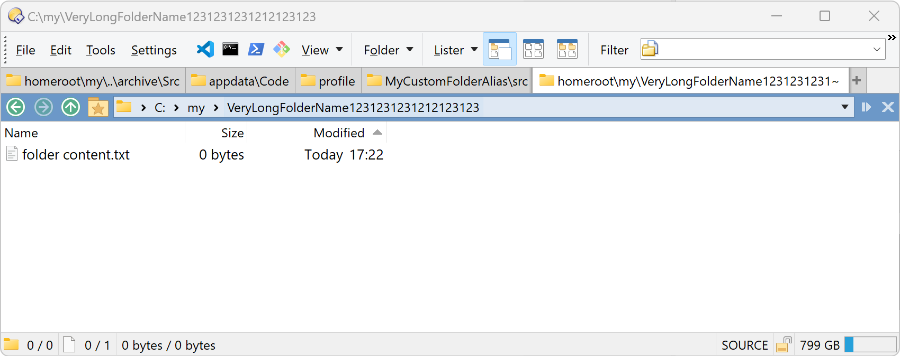
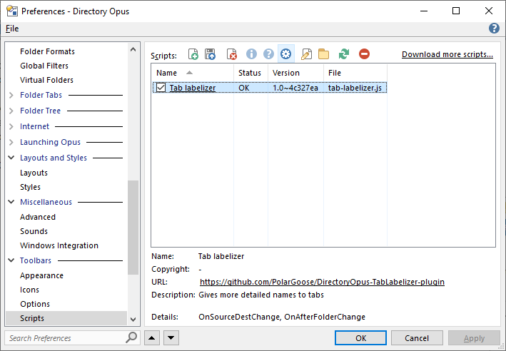

# Description
A plugin for [Directory Opus](https://www.gpsoft.com.au/) to assign more detailed names to tabs.

# How to use
* Download the `.js` file from the latest [release](https://github.com/PolarGoose/DirectoryOpus-TabLabelizer-plugin/releases).
* Open `DirectoryOpus->Preferences->Scripting` menu.
  * Remove old version of `tab-labelizer.js` if it is installed.
  * Drag and drop new `tab-labelizer.js` file there and click `OK`: 
 
* Afterwards, every time you open a tab or change a folder, the tab label will display the full/shortened path in its label, taking into account defined folder aliases, as shown in the screenshot in the Description.
* Script configuration:
  * You can specify the maximum tab length in the script configuration menu
  * You can customize the folder aliases ignore list by modifying `folderAliasesToIgnore` variable at the beginning of the script

# References
* [Discussion of this plugin on DOpus forum](https://resource.dopus.com/t/tab-labelizer-plugin-to-assign-more-detailed-names-to-tabs/37275)
* [Directory Opus 12 Scripting Reference](https://www.gpsoft.com.au/help/opus12/index.html#!Documents/scriptingreference.htm)
* [JScript language reference](https://learn.microsoft.com/en-us/previous-versions/windows/internet-explorer/ie-developer/scripting-articles/yek4tbz0(v=vs.84))
* [Windows Script Host / ActiveScript Reference Manuals](https://resource.dopus.com/t/here-are-the-windows-script-host-activescript-reference-manuals/31193)
